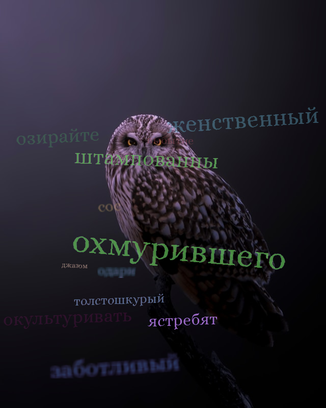

# SynthTextGenerator
This project provides simple way for generate marked images with text. Supported all languages, fonts and background images.

## Usage
<code>git clone https://github.com/h128bit/SynthTextGenerator.git</code>

~~~
from synthetic import generate

path_to_background = "resources/backgrounds"
path_to_fonts = "resources/fonts"
path_to_corpus = "resources/corpus/corpus.txt"
path_to_save = "resources/result"
encoding='windows-1251' # encoding for corpus.txt file

d = {
    "path_to_corpus": path_to_corpus,
    "encoding": encoding,
    "path_to_fonts": path_to_fonts,
    "path_to_background": path_to_background,
    "path_to_save": path_to_save,
    "num_images": 2
}

generate(**d)

~~~

In <code>path_to_save</code> folder will be created folders <code>src</code> to save text scenes, <code>mask</code> to save masks for text scenes 
and create file <code>meta_info.json</code> contain information about words, four point word polygon, font name, font size, and word color on text scene.

## Example

<table>
  <tr>
    <th></th>
    <th></th>
  </tr>
  <tr>
    <td></td>
    <td></td>
  </tr>
</table>

